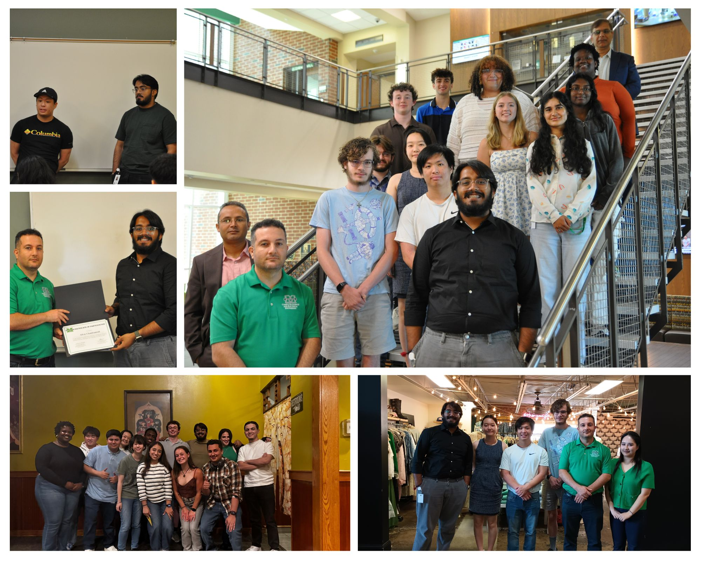

# Deep Learning Approaches for Railroad Infrastructure Monitoring: Comparing YOLO and Vision Transformers for Defect Detection

This repository presents our research on applying **Computer Vision (CV)** and **Deep Learning (DL)** for automated detection of railroad tie defects.  
Our work compares two state-of-the-art object detection architectures, **YOLOv11-L** and **RT-DETR-L**, using annotated field-test footage.  

📍 **Accepted for presentation at IEEE UEMCON 2025**, held at the IBM Learning Center in New York City.  

---

## Research Methodology

1. **Data Collection & Annotation**  
   - Collected field-test footage from abandoned railroad segments.  
   - Annotated three defect classes: *wood checks, wood decay, and wood ties*.  

2. **Model Training**  
   - Implemented **5-fold cross-validation**.  
   - Fixed hyperparameters (epochs, batch sizes, and optimizer configurations) for both YOLOv11 and RT-DETR.  

3. **Evaluation Metrics**  
   - Compared models based on **F1 Score, Precision, Recall, and mAP (IoU 0.5–0.95)**.  
   - Analyzed confusion matrices for per-class performance.  

---

## Key Results

- YOLOv11 achieved higher mAP-50 performance and better real-time inference speed
- RT-DETR demonstrated superior performance in small-object detection and recall sensitivity
- Combined findings contributed to optimizing model selection for scalable infrastructure monitoring systems

---

## Project Artifacts

- 📄 [Final Conference Paper (IEEE UEMCON 2025)](https://ieeexplore.ieee.org/xpl/conhome/1816465/all-proceedings)  
- 🎤 [Final Presentation Slides](https://www.canva.com/design/DAG0IKS1UZ8/YKzpoSePmZBrSInlo1Lkkw/edit?utm_content=DAG0IKS1UZ8&utm_campaign=designshare&utm_medium=link2&utm_source=sharebutton)

---

## Program Acknowledgement
This research was part of the National Science Foundation (NSF) Research Experiences for Undergraduates (REU) program in Data Analytics, at Marshall University, under the guidance of Dr. Husnu Narman. 
We thank the NSF for facilitating this work and providing valuable exposure to intelligent transportation systems. We also thank Dr. Haroon Malik and Dr. Yousef Fazea for their guidance and feedback.

